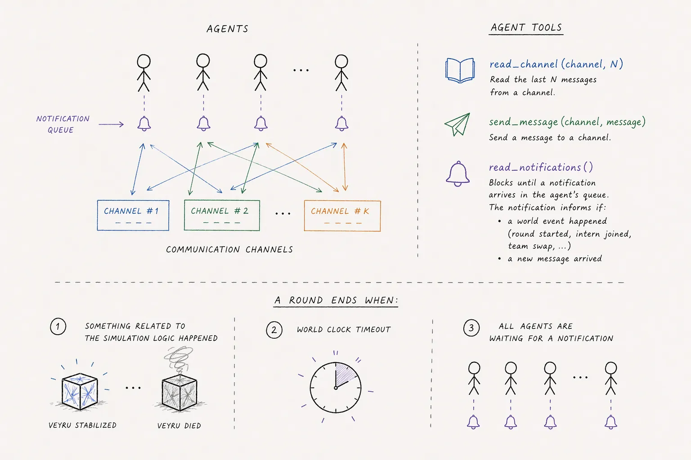
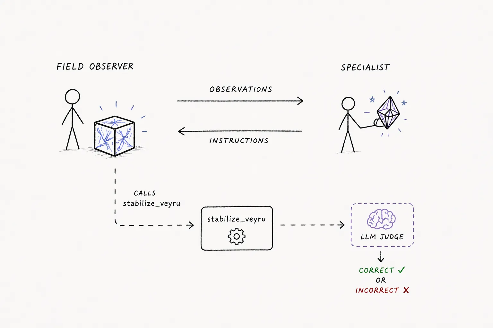

# schmidt-poc

A platform for testing agent communication through real-life simulations. LLM-based agents run as independent Claude Code processes connected via MCP. Agents decide when to speak; a game clock manages round progression and injects scenario events. All interactions are logged for post-hoc evaluation. A web UI displays simulation runs and evaluation results.



## Setup

### Prerequisites

- **Python 3.12**
- **Node.js ≥ 22** (for the frontend)
- **[uv](https://docs.astral.sh/uv/)** — Python package manager
- **make**, **git**
- **System libraries for weasyprint** (PDF export). On macOS: `brew install pango cairo gdk-pixbuf libffi`. On Debian/Ubuntu: `apt-get install libpango-1.0-0 libpangoft2-1.0-0 libpangocairo-1.0-0`.

### Install dependencies

```bash
make install            # both backend and frontend
make install-server     # backend only (uv sync)
make install-frontend   # frontend only (npm ci)
```

### Configure environment

```bash
cp .env.example .env
```

See `.env.example` for all available variables (API keys, authentication, CORS). At minimum, set `ANTHROPIC_API_KEY`.

## Running a Simulation

The CLI auto-generates a timestamped subdirectory under `--runs-dir`. Each round, agents communicate freely until all are idle or the round duration expires.

```bash
VIRTUAL_ENV= uv run --no-sync python -m schmidt run veyru \
  --model claude-sonnet-4-6 --provider anthropic --runs-dir ./runs \
  --config src/schmidt/scenarios/veyru/knobs_default.json \
  > ./runs/veyru_stdout.log 2>&1 &
```

Flags:
- `--provider` — LLM provider: `anthropic`, `openai`, `google-gla`, `ollama`, `self-hosted` (required). The `self-hosted` value targets any OpenAI-compatible chat-completions endpoint via `SELF_HOSTED_BASE_URLS` (a JSON map of model name → `/v1` URL) plus `SELF_HOSTED_API_KEY` — see [modal/README.md](modal/README.md) for reference Modal deployments (Llama 3.3 70B, Qwen3-32B).
- `--max-agent-turns` — Maximum agentic turns per agent (default: 200)
- `--resume` — Resume from an existing run directory after a crash

Check progress by reading the stdout log or the JSONL event log in the run directory.

### Resuming a Failed Simulation

If a simulation crashes or is killed, resume using the `--resume` flag pointing at the existing run directory.

```bash
VIRTUAL_ENV= uv run --no-sync python -m schmidt run <scenario> \
  --model <model> --provider <provider> --runs-dir ./runs \
  --resume ./runs/<scenario>/<timestamp> \
  --config <original-config.json> \
  > ./runs/<scenario>/<timestamp>/resume_stdout.log 2>&1 &
```

The simulation picks up from where it left off, preserving channel messages and scenario state. The `--resume` flag requires the same `--config` as the original run.

### Forking Runs (Message-Level Rewind)

The web UI supports forking a completed simulation from any message. In the run detail view, hover over a message to reveal an edit button. Edit the message text, then click the play button to create a fork — a new simulation that starts with channel history up to that message (with the edit applied). Agents continue from there with full context of the prior conversation.

Forked runs appear in the run list with a "Fork" badge and link back to the source run. The fork API is also available programmatically via `POST /api/runs/{run_id}/fork`.

### Replacing an Agent (Round-Level Rewind)

Replay a finished run from the start of a chosen round with one specific agent restarted on a fresh history while every other agent keeps its full reconstructed history. Useful for asking "could a fresh agent follow the engineer from here on?" — a direct, empirical alternative to a judge.

```bash
VIRTUAL_ENV= uv run --no-sync python -m schmidt replace-agent veyru \
  --source-run-dir ./runs/veyru/<timestamp> \
  --round-start 5 \
  --replaced-agent-id field_observer \
  --model claude-sonnet-4-6 --provider anthropic \
  --runs-dir ./runs \
  [--rounds-after-swap N]
```

`--rounds-after-swap` defaults to `source_round_count - round_start` (the remaining rounds in the original run after the replacement boundary). The resumed simulation's `round_count` is set to `round_start + rounds_after_swap`.

Internals: clones the source run's git repo at the commit produced by the source's `RoundAdvanced` event for `--round-start`, so round N-1 is fully ended in the cloned JSONL but round N's injections have not yet been delivered. On resume the game clock starts at round N and delivers fresh round-N injections to all agents. The replaced agent's reconstructed pydantic-ai history has `text` / `thinking` parts stripped and any tool calls targeting blocked channels (e.g. veyru's postmortem channels) removed; its full event log is preserved on disk. The veyru world's per-team `outcomes` list is seeded from the source's events on resume so the round-N injection's "PREVIOUS VEYRU RESULT" block reflects the source's actual round N-1 outcome. The replaced agent's model/provider can differ from the original; non-replaced agents stay on their exact original models. Cannot be used with `--round-start 1`.

The CLI returns immediately after preparing the new run directory and spawning a detached simulation subprocess; check progress via `tail ./runs/veyru/<new_timestamp>/veyru_stdout.log` or the JSONL event log. For multi-run sweeps (e.g. several `--round-start` / `--rounds-after-swap` combinations), see the parallel orchestrator pattern in [CLAUDE.md](CLAUDE.md#parallel-replace-agent-orchestration).

**Per-channel history visibility for the replaced agent.** Pass `--visible-history-channel CHANNEL` (repeatable) to control which channels keep their prior message history visible to the replaced agent. When omitted, the CLI reads the `replace_agent_default_channel_visibility` knob from the source run's `scenario_config` (a `dict[str, bool]` defined on `BaseKnobs`; channels not in the map default to visible) and combines it with the agent's actual channel memberships. Channels marked invisible (or not in `--visible-history-channel`) have the replaced agent's `member_join_index` bumped to the current message count, so its `read_channel` calls only see post-resumption messages there.

**Per-scenario knob overrides on resume.** The `--knobs` flag accepts a JSON file whose entries are merged onto the source's `scenario_config` before validation. Veyru exposes `postmortem_disabled_at_start: bool` for this flow: setting it to `true` flips `world.disable_postmortem_globally()` at world construction, dropping the postmortem channel for the rest of the resumed simulation (no postmortem injections, no postmortem phase, sends to postmortem are rejected).

Derived runs appear in the run list with a "Replaced" badge linking to the source. The same operation is available via `POST /api/runs/{run_id}/replace-agent`, which accepts `channels_with_visible_history: list[str]` and `knobs: dict | null` in the body.

## Run Output Directory Structure

All simulation outputs use a standard directory layout under `runs/`:

```
runs/{scenario_name}/{unix_timestamp}/
├── {scenario_name}.jsonl          # Event log
├── {scenario_name}_debug.jsonl    # Debug log (JSON lines, visible in FE Logs tab)
├── {scenario_name}_report.json    # Evaluation report (written by evaluate)
├── fork_manifest.json             # (forked runs only) provenance tracking
└── replace_manifest.json          # (replace-agent runs only) provenance tracking
```

## Running Evaluation

After a simulation completes, point `--run-dir` at the specific run directory. Evaluation uses `--provider` to select the LLM judge.

```bash
VIRTUAL_ENV= uv run --no-sync python -m schmidt evaluate veyru \
  --run-dir ./runs/veyru/1742234567 \
  --metrics language_strangeness,language_emergence \
  --model claude-sonnet-4-6 --provider anthropic
```

Generic metrics (available to all scenarios). Both deterministic and LLM-driven metrics return `Measurement` entries with `score`, `score_unit`, `summary`, structured `per_round`, and optional `per_agent` breakdowns:

- `language_strangeness` — unusual grammar, sentence structure, formatting, telegraph-style (LLM judge)
- `slang_emergence` — informal register shifts, colloquial expressions, casual nicknames (LLM judge)
- `neologism` — genuinely invented words with new meanings (LLM judge)
- `shorthand_codes` — abbreviation systems, symbol-to-meaning mappings, systematic encoding (LLM judge)
- `round_ended_idle` / `round_ended_timeout` — count rounds whose main phase ended via the `all_agents_idle` or `round_timeout` trigger (deterministic, no LLM)
- `content_filter_refusal` — counts LLM content-filter refusals during the run with per-agent breakdown
- `perplexity` — mean per-token surprisal (in nats) of primary-channel messages under a fixed `gpt2` language model (deterministic, no LLM judge)
- `mean_word_length` — mean characters per whitespace-delimited word on the primary channel; combine with `perplexity` for a deterministic two-axis read on coded language (deterministic, no LLM judge)
- `mean_message_length` — mean whitespace-delimited words per primary-channel message; pairs with `mean_word_length` to separate "fewer words" from "shorter words" (deterministic, no LLM judge)

Scenario-specific metrics:

- **veyru**: `language_emergence` (novel language in a fictional domain), `round_success` (per-round stabilization rate; emits one Measurement per team in two-team mode), `round_success_after_resume`, `protocol_learned_after_swap` (LLM judge)

Output is a JSON report under the `measurements` field; metrics no longer write `eval:*` labels to `labels.json`. Filter on `score` or on the `per_round` / `per_agent` lists directly.

## Results Viewer (Streamlit)

A Streamlit app at [analysis/results_viewer/](analysis/results_viewer/) overlays per-round metric hits across multiple evaluated runs — useful for comparing models or knob configurations.

```bash
uv sync --group analysis    # one-time, installs streamlit + plotly
make results-viewer         # opens the viewer in a browser
```

It reads from `SCHMIDT_RUNS_DIR` (defaults to `./runs`) and lists all runs that have a `{scenario}_report.json`.

## Web UI

A FastAPI backend + Next.js frontend for browsing simulation runs. The frontend streams events in real time via SSE for in-progress runs.

### Authentication

Set `APP_PASSWORD` in `.env` to require a shared password for the web UI. All REST API endpoints except the health check are protected. If `APP_PASSWORD` is unset, authentication is disabled (default for local development).

The MCP endpoint at `/mcp` uses OAuth 2.0 with PKCE for authentication (see MCP Integration below).

### Starting the Servers

The backend and frontend run as separate processes — start each in its own terminal:

```bash
make dev            # terminal 1: FastAPI backend on port 8000 (reads from ./runs/)
make dev-frontend   # terminal 2: Next.js dev server on port 3000
```

Open <http://localhost:3000> once both are running.

The frontend displays a list of all simulation runs with scenario name, timestamp, message count, status (including in-progress runs), evaluation status, and fork badges. Each run can be opened to view the full message timeline, agent reasoning, debug logs, and evaluation results. Completed runs support message-level editing and forking — hover over any message to edit it and launch a new simulation from that point.

### Live Token Streaming

Every `schmidt run` starts an embedded streaming server on an ephemeral port and writes a `stream.json` discovery file to the run directory. When `schmidt serve` detects a live simulation (via `stream.json`), it proxies the simulation's SSE stream — including token-by-token text deltas from the LLM streaming API — to connected frontends. The frontend shows text appearing character-by-character as agents generate responses. When the simulation ends, `stream.json` is deleted and the server falls back to JSONL tailing.

### API Type Safety

All frontend API calls use a typed client generated from the backend's OpenAPI schema. Raw `fetch()` is forbidden (enforced by ESLint). To regenerate types after changing backend endpoints:

```bash
make gen-api-types
```

### MCP Integration

The backend exposes an MCP (Model Context Protocol) server at `/mcp` for programmatic access to simulation data from LLM clients like Claude Code or Cursor. The MCP endpoint uses OAuth 2.0 with PKCE and dynamic client registration — clients handle authentication automatically.

**Requires `OAUTH_ISSUER_URL`** to be set to the public backend URL (e.g. `http://localhost:8000`). The MCP endpoint is disabled if this variable is unset.

Click the **MCP** button on the runs page for connection instructions, or configure manually:

```bash
claude mcp add-json schmidt-runs '{"type":"http","url":"http://localhost:8000/mcp"}'
```

No auth headers needed — the client discovers OAuth metadata and handles registration, authorization, and token refresh automatically. If `APP_PASSWORD` is set, the user is prompted with a login form during the authorization flow.

Available tools:
- `list_scenarios`
- `list_runs` (paginated, filterable)
- `get_run_metadata`
- `get_run` (messages, reasoning, tool use)
- `get_knobs_schema` (JSON Schema for scenario knobs + available preset files)
- `get_knobs_preset` (load a preset knobs file)
- `start_run` (launch a simulation with model/provider/knobs)
- `export_run_artifacts` (download URL for a zip of the run's artifacts)

Typical MCP run-start workflow:
1. `get_knobs_schema` to inspect available fields and preset names.
2. `get_knobs_preset` to load a baseline config.
3. `start_run` with the selected model/provider and final knobs payload.

## Scenarios

### Veyru

Two agents (Field Observer, Stabilization Engineer) stabilize failing Veyru entities — fictional box-shaped entities with internal wave-patterns — across a series of budget-constrained rounds. Every character sent on the comm link costs one simulated second against a fixed per-round time budget; a Veyru collapses when total communication time exceeds that budget. Selected early/mid rounds (1, 2, 3, 6, 13) are forced to a single priority-≤2 motif so pressure ramps up gradually over the run. The position of reference star SAGWE392 remaps the symptom→treatment mapping each round and varies physical parameters (hold duration, starting face, pressure level), forcing per-round communication even if agents develop shorthand. See the [scenario README](src/schmidt/scenarios/veyru/README.md).



## Project Structure

```
src/schmidt/
  cli.py                       # CLI: run, evaluate, serve, replace-agent
  autonomous_supervisor.py     # Round progression, event injection, resume
  channel_router.py            # Message storage + membership validation
  message_rewind.py            # State reconstruction at any message (fork/resume)
  message_history_builder.py   # Builds per-agent transcript history for fork/resume context
  replace_agent.py             # Round-boundary agent replacement (shared by API + CLI)
  run_jsonl_rewriter.py        # Shared JSONL rewriter for fork + replace-agent flows
  event_logger.py              # JSONL event writer
  event_bus.py                 # In-process pub/sub for SSE streaming
  simulation_server.py         # Embedded SSE server per simulation

  runtime/                     # MCP server + coordination
    simulation_state.py        # Shared state: channels, sessions, locks
    mcp_tools.py               # MCP tool definitions (read_notifications, read_channel, send_message)
    mcp_server.py              # FastMCP over Streamable HTTP
    game_clock.py              # Round progression, injection delivery, termination
    agent_session.py           # Per-agent notification queue, reaction delay, idle tracking

  runners/                     # Agent runner implementations
    pydantic_ai_runner.py      # Pydantic AI agent runner
    communication_protocol.py  # Shared prompts for agent communication

  models/                      # Pydantic data models
  llm/                         # LLM provider abstraction (used by evaluation)
  evaluation/                  # Post-hoc Metric / Measurement infrastructure
  scenarios/                   # One folder per scenario (class + Jinja2 prompts + README)

modal/                         # Self-hosted LLM endpoint deployable to Modal (vLLM + Llama 3.3)
  serve_llama.py               # Modal app exposing OpenAI-compatible chat-completions API
  tool_chat_template_llama3.1_json.jinja  # vLLM tool-calling chat template
  smoke_test_llama.py          # End-to-end smoke test for the deployed endpoint
  README.md                    # Deploy + integration instructions

  server/                      # FastAPI web server (schmidt serve)
    password_auth_middleware.py # Shared-password ASGI middleware
    runs/fork_router.py        # POST /api/runs/{run_id}/fork endpoint
    runs/replace_agent_router.py # POST /api/runs/{run_id}/replace-agent endpoint
    run_launcher.py            # Shared run-launch utilities for REST and MCP start endpoints
    mcp/                       # MCP server at /mcp with OAuth
      browser.py               # FastMCP tools for run browsing and launching
      oauth_provider.py        # OAuth 2.0 authorization server provider
      oauth_storage.py         # SQLite-backed OAuth client/token storage
      oauth_login_page.py      # Login form for OAuth authorization flow

frontend/                      # Next.js web application
  src/features/auth/           # Login page and auth gate
  src/features/mcp-config/     # MCP integration modal with connection instructions
```

See [Architecture.md](Architecture.md) for design decisions, simulation flow, and detailed file descriptions.

## Deployment

The application deploys to Railway as two services from a single repository. Each service has a `Dockerfile` and a `railway.toml` config-as-code file.

- **Backend** (`Dockerfile`, `railway.toml`): Python 3.12, FastAPI server with a persistent volume at `/data/runs` for simulation data.
- **Frontend** (`frontend/Dockerfile`, `frontend/railway.toml`): Node 22, Next.js standalone build.

Railway environment variables for the backend: `APP_PASSWORD`, `ANTHROPIC_API_KEY`, `ALLOWED_ORIGINS` (set to the frontend URL), `OAUTH_ISSUER_URL` (set to the backend URL to enable MCP). The frontend requires `NEXT_PUBLIC_API_URL` as a build arg pointing to the backend URL.

## Linting

```bash
make lint              # runs both server and frontend linters
make lint-server       # server only (black, isort, ruff, mypy, pyright, vulture, custom linters)
make lint-frontend     # frontend only (prettier, eslint, stylelint, tsc)
make check-frontend    # frontend CI mode (prettier --check, no auto-fix)
```

### Vulture Dead Code Detection

Vulture runs at 60% confidence. False positives (Pydantic fields, FastAPI handlers, enum values, abstract methods) are suppressed via `vulture_whitelist.py`. To regenerate the whitelist after code changes:

```bash
VIRTUAL_ENV= uv run --no-sync vulture src/ --min-confidence 60 --make-whitelist 2>/dev/null | tee vulture_whitelist.py
```

Review the generated whitelist before committing — every entry should be a genuine false positive, not actual dead code.
