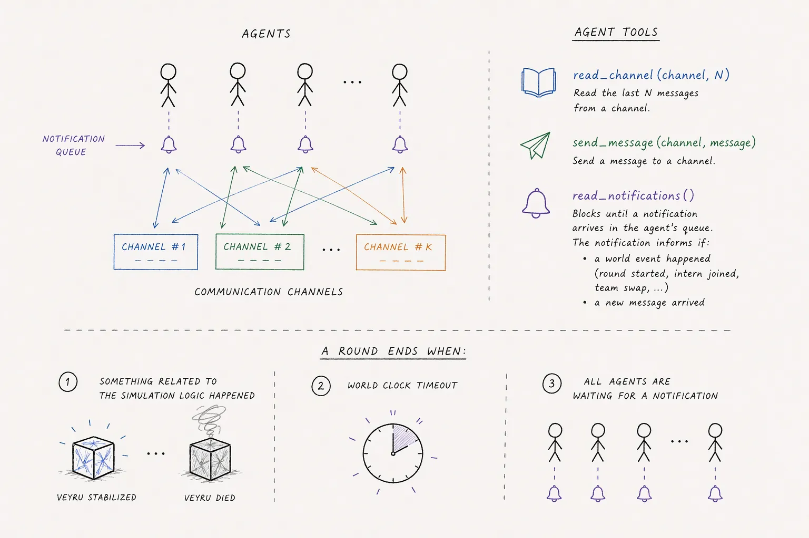

# GlossoGen

**[Documentation](https://agencyenterprise.github.io/GlossoGen/)** ·
[Quickstart](docs/quickstart.md) · [Scenarios](docs/scenarios.md) ·
[Live demo](https://emergentcomms.ai/demo)

A platform for studying how LLM agents communicate when they have to. Agents are
put in a simulated task where no single one of them holds enough information to
succeed, so nothing gets solved without talking. In most scenarios every character
they send then costs against a fixed per-round budget, and under that pressure they
compress, abbreviate, and invent shorthand. The platform records all of it and
scores it afterwards.

The budget is a knob, and some scenarios ship with it off: `spot_the_difference`
rewards the team that said the least, and `hospital_bed_assignment_privacy` puts
an eavesdropper on the shared channel, so speaking plainly loses the round. [Scenarios](docs/scenarios.md) has
the per-scenario numbers.

Agents decide for themselves when to speak. A game clock advances rounds and
injects scenario events; every message, tool call and model response lands in a
JSONL event log, which is the ledger everything else reads: evaluation metrics,
the web UI, and the flows that rewind a finished run and replay it with a different
agent in one seat.



Experiments run contained. A simulated agent's only tools are the channel
primitives and the scenario tools served by a loopback-bound MCP server, so it has
no route to another model, to the host system, or to anything outside its own run.
See [Containment of simulated agents](SECURITY.md#containment-of-simulated-agents).

## Documentation

Browsable and searchable at
**[agencyenterprise.github.io/GlossoGen](https://agencyenterprise.github.io/GlossoGen/)**,
versioned per release, so a pinned tag reads the contract it was written against.
Everything is also here in the repository. The rows below Contributing are
repository-only: a design write-up, and research notes from the studies this
platform was built for. Neither is documentation for using the platform, so the
site leaves them out.

| | |
|---|---|
| [Quickstart](docs/quickstart.md) | Run one, read it, score it |
| [Notebooks](notebooks/) | Runnable examples; they generate their own run, so no API key |
| [Installation](docs/installation.md) | Prerequisites, optional extras, Postgres, environment |
| [Running simulations](docs/running-simulations.md) | Configuration, per-agent models, self-hosted models, cost |
| [Evaluation](docs/evaluation.md) | The metric catalogue, judge auditing, analysing results |
| [Scenarios](docs/scenarios.md) | What ships in the box, and which to pick |
| [Agent swaps and resume](docs/agent-swaps.md) | Replaying a run from a chosen round, with or without a new agent |
| [Web UI](docs/web-ui.md) | Running the servers, authentication, live streaming |
| [MCP integration](docs/mcp-integration.md) | Browsing and launching runs from an LLM client |
| [Creating a scenario](docs/creating-a-scenario.md) | Writing your own, here or in your own package |
| [Creating a metric](docs/creating-a-metric.md) | Adding a measurement, here or in your own package |
| [Testing a scenario](docs/testing-a-scenario.md) | The `glossogen.testing` harness: contract checks and scripted runs |
| [Local inference](docs/local-inference-vllm-mlx.md) | vLLM and MLX backends |
| [Deployment](docs/deployment.md) | Docker Compose, images, Railway |
| [Contributing](CONTRIBUTING.md) | Conventions, tests, releases |
| [Architecture](Architecture.md) | Design decisions and how the pieces fit |
| [Communication metrics](docs/communication-metrics.md) | What each language number means and how to read them together |
| [Compaction and history cleanup](docs/compaction-and-clean-history-cost.md) | Measured cost and success effects of both features |
| [The judge-decodability exploit](docs/judge-decodability-exploit.md) | How a judge given the ground truth scored rounds the agents had not solved |
| [Learnings](docs/learnings.md) | What we tried, what happened, and why we changed course |

## Install

Needs Python 3.12, Node ≥ 22, [uv](https://docs.astral.sh/uv/), make and git.

```bash
make install            # backend and frontend
make install-metrics    # add this if you will run evaluations (pulls torch)
cp .env.example .env    # then set ANTHROPIC_API_KEY
```

Postgres is optional: leave `DATABASE_URL` unset and the runs index comes from the
filesystem. [Installation](docs/installation.md) has the weasyprint system
libraries and the optional extras.

To write a scenario or a metric in your own package, install glossogen as a
dependency instead of cloning it. It is not on PyPI, so pin a tag from
[the releases page](https://github.com/agencyenterprise/GlossoGen/releases):

```bash
uv add "glossogen @ git+https://github.com/agencyenterprise/GlossoGen.git@<tag>"
```

Your package declares its scenario or metric as an entry point and the platform
picks it up, with no change to this repository. See
[As a dependency](docs/installation.md#as-a-dependency).

## Run a simulation

```bash
VIRTUAL_ENV= uv run --no-sync python -m glossogen run veyru \
  --model claude-sonnet-4-6 --provider anthropic --runs-dir ./runs \
  --config knobs_default \
  > ./runs/veyru_stdout.log 2>&1 &
```

All four flags are required, and `--config` names a preset the scenario ships or a
path to a knobs JSON of your own. Output goes to a timestamped directory under
`--runs-dir`.

**A run spends real money against your own keys.** Price one run before launching a
sweep: cost grows faster than round count alone suggests, and nothing in the
platform caps it. See
[Understanding cost](docs/running-simulations.md#understanding-cost).

[Quickstart](docs/quickstart.md) walks one run end to end.
[Running simulations](docs/running-simulations.md) has knobs and presets, per-agent
models, self-hosted endpoints and resuming after a crash.

## Evaluate a run

```bash
VIRTUAL_ENV= uv run --no-sync python -m glossogen evaluate veyru \
  --run-dir ./runs/veyru/1742234567 \
  --metrics round_success,mean_chars_per_round,shorthand_codes \
  --model claude-haiku-4-5-20251001 --provider anthropic
```

`--model` and `--provider` pick the LLM judge; deterministic metrics ignore them.
Results land in `<scenario>_report.json` in the run directory, one measurement per
metric with per-round and per-agent breakdowns.

Metrics are generic. A scenario opts into one by implementing the hook that metric
reads, so the same measurement works on any scenario, including one installed from
another package. The catalogue and the hook table are in
[Evaluation](docs/evaluation.md).

Wait for the `simulation_ended` event before evaluating. A round-count check fires
one round early and silently drops the last round.

## Web UI

One command serves the API and the UI against a runs directory, from wherever
glossogen is installed:

```bash
glossogen serve --runs-dir ./runs --port 8000 --ui-port 3000
```

Browse runs at <http://localhost:3000>: message timeline, agent reasoning, debug
logs, evaluation results, lineage badges for derived runs, and live token streaming
for a simulation that is still going. There is no launch button; runs start from
the CLI or over MCP.

`--ui-port` runs the published frontend image, which needs Docker but no checkout.
Omit it to serve the API alone. From a clone, run the two halves separately while
changing the frontend:

```bash
make dev            # backend on :8000
make dev-frontend   # frontend on :3000
```

See [Web UI](docs/web-ui.md).

## Observability

Simulation agents are instrumented through
[pydantic-ai](https://ai.pydantic.dev/)'s OpenTelemetry support, exporting every
LLM call (prompts, completions, tool calls, token usage, latency, cost) to a
**local, self-hosted [Langfuse](https://langfuse.com/)**, never a cloud endpoint.

```bash
make langfuse-up      # start the stack (web, worker, postgres, clickhouse, redis, minio)
make langfuse-down    # stop it
make langfuse-logs    # tail langfuse-web
```

UI at <http://localhost:3001>, since the frontend dev server owns 3000. First boot
takes a couple of minutes while migrations run. Log in with `local@glossogen.dev` /
`local-dev-password`; the org, the project and the two API keys are seeded on first
boot, so nothing has to be created in the UI. Each run is one Langfuse session keyed
by `run_id`, with every agent's cycles underneath it tagged by `agent_id` /
`role_name` / `model` / `provider` / `scenario`, and each generation carrying its
`round_number`.

Tracing is on only when both `LANGFUSE_*` keys are set, and only for `glossogen
run`; the judge and probe calls in `glossogen evaluate` are not traced. If the stack
is down or the keys are blank, a run logs one warning and proceeds untraced.
Telemetry never blocks a simulation. Running the stack from an installed package
rather than a clone takes one extra step, in
[Tracing from your own project](docs/installation.md#tracing-from-your-own-project).

## Extend it

A scenario and a metric are both self-contained, and both can live in this
repository or in a package of your own. To start one in a package of your own,
generate it rather than assembling it:

```bash
glossogen new-scenario reactor_purge --target-dir .
cd reactor-purge && glossogen validate .
pip install -e ".[testing]" && pytest
```

What that writes is a scenario that already runs, which is then yours to edit.
`glossogen validate <dir>` needs no install, so it is the command to keep running
while you edit it.

- [Creating a scenario](docs/creating-a-scenario.md) — the generator, package
  layout, the engine declarations, every optional extension surface, a smoke-test
  recipe and a pre-flight checklist.
- [Creating a metric](docs/creating-a-metric.md) — the `Metric` contract, both
  registration paths, and how to run one.
- [Testing a scenario](docs/testing-a-scenario.md) — `glossogen.testing`: the
  contract checks, the scripted round loop, and why the harness controls the
  clock rather than waiting on it.

## Deployment

`docker compose up --build` runs the whole stack locally in single-tenant mode.
Hosted deployments run the backend and frontend as two services, with Postgres and
a volume for run data. See [Deployment](docs/deployment.md).

## Contributing

[CONTRIBUTING.md](CONTRIBUTING.md) covers the conventions, the test suite and how
releases are cut. `make lint` and `make test` need to pass before a pull request.
For anything security-related, follow [SECURITY.md](SECURITY.md) rather than
opening a public issue.
