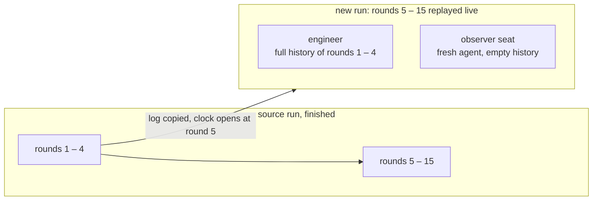
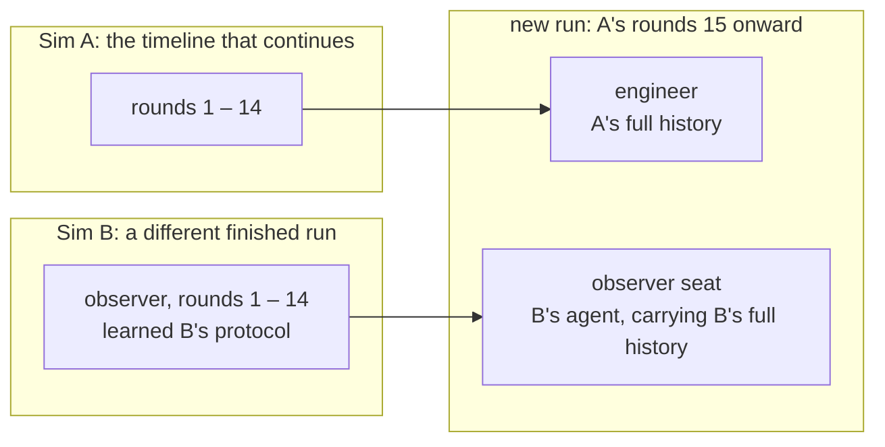
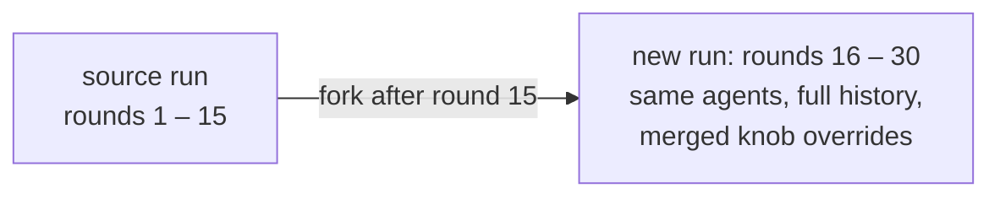
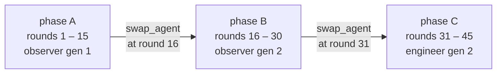

# Agent swaps and forks

These commands fork a finished run into a new one. They exist to answer questions a judge can
only estimate, by putting a different agent in the same seat and measuring what
happens.

Every fork cuts at the *end* of a round: `--after-round N` keeps rounds 1..N
complete, verdict and postmortem included, and the new run plays round N+1
onward.

| Command | What it does |
|---|---|
| [`replace-agent`](#replace-an-agent-at-a-round-boundary) | Fork after round N with one agent restarted on a fresh history |
| [`cross-run-replace-agent`](#import-an-agent-from-another-run) | Same, but the seat is filled by an agent carrying its full history from a *different* run |
| [`fork-at-round`](#fork-at-a-round-no-replacement) | Fork after round N with no agent replaced, under merged knob overrides |
| [`scheduled_events`](#in-run-swaps) | Swap agents at round boundaries inside one live run |

All four keep every non-replaced agent on its exact original model and full
reconstructed history. To carry on inside an existing run instead of forking it
into a new one, see
[Continuing a run](running-simulations.md#continuing-a-run).

Each command prepares the new run directory, prints `new_run_id=` and
`new_run_dir=`, and spawns a detached simulation. Watch
`<new_run_dir>/<scenario>_stdout.log` for progress. From a checkout, spell each command
`VIRTUAL_ENV= uv run --no-sync python -m glossogen ...`.

For the mechanics behind all of this (how a run is cloned, how a history is
rebuilt, how the boundary round is ordered), see Architecture:
[replace-agent](../Architecture.md#replace-agent-system-round-level-rewind),
[cross-run](../Architecture.md#cross-run-replace-agent-system-round-level-rewind-different-source-for-the-imported-agent),
[fork-at-round](../Architecture.md#fork-at-round-system-post-hoc-fork-no-agent-replacement),
[in-run swaps](../Architecture.md#in-run-agent-swaps-round-boundary-scheduler).

## Replace an agent at a round boundary

Keeps rounds 1..N as the source played them and restarts one agent on a fresh
history for round N+1 onward, while everyone else continues from where they
were. The question it answers: could a newcomer pick up the protocol the others
built?



```bash
glossogen replace-agent veyru \
  --source-run-dir ./runs/veyru/<timestamp> \
  --after-round 4 \
  --replaced-agent-id field_observer \
  --model claude-sonnet-4-6 --provider anthropic \
  --runs-dir ./runs \
  [--rounds-after K] \
  [--visible-history-channel CHANNEL ...] \
  [--history-from-round R] \
  [--knobs <preset-name|path>]
```

- `--after-round` must be ≥ 1.
- `--rounds-after` defaults to the source rounds past the boundary
  (`source_round_count - after_round`). The new run's `round_count` becomes
  `after_round + rounds_after`.
- `--model` / `--provider` set the replacement agent only.
- `--knobs` names a preset the scenario ships, or a path to a JSON file of your
  own, merged onto the source's recorded `scenario_config` before validation.
  It resolves exactly as `--config` does on `run`, and is optional: no overrides
  is a resumed run's normal state. A whole preset passed here replaces every
  field it declares, so an override file naming only what changes is usually
  what you want.

The replaced agent's own event log is preserved on disk. What it *sees* is
reconstructed without `text` and `thinking` parts, and without tool calls on
channels the scenario blocks (veyru's postmortem, for instance).

Veyru exposes `postmortem_disabled_at_start: true` for this flow, which drops the
postmortem channel for the rest of the resumed run: no postmortem injections, no
postmortem phase, sends rejected.

## Import an agent from another run

Fills the seat with an agent from a *different* completed run, carrying its full
history (text, thinking, tool calls) from that run. Same scenario and same
`agent_id` only. The question it answers: how does an agent that learned one
protocol behave when dropped into a team that learned another?



```bash
glossogen cross-run-replace-agent veyru \
  --source-a-run-dir ./runs/veyru/<sim_a_timestamp> \
  --source-b-run-dir ./runs/veyru/<sim_b_timestamp> \
  --replaced-agent-id field_observer \
  --after-round 14 \
  --runs-dir ./runs \
  [--source-b-round-end N] \
  [--model M --provider P] \
  [--rounds-after K] \
  [--visible-history-channel CHANNEL ...] \
  [--knobs <preset-name|path>]
```

Sim A is the timeline that continues. Sim B is where the imported agent comes
from.

- `--source-b-round-end` defaults to `min(after_round, B_max_round)`, the
  largest slice of B that is temporally aligned with A's swap point without
  exceeding what B actually played.
- `--model` / `--provider` default to whatever the imported agent ran under in
  Sim B. Pass both together to override, which is how you test a different model
  in the same seat.

A cross-run run cannot itself be forked again: its log holds the
replaced-away agent's turns before the import boundary, so a fork would seed
the seat with the wrong agent.

**Set `postmortem_disabled_at_start` for veyru cross-team runs.** This flow does
not set it. Without it the two agents have a backchannel that re-aligns
their protocols within a round or two, which washes out the effect you are trying
to measure.

## Fork at a round (no replacement)

Forks after round N with no agent replaced. Every agent keeps its full history,
and the fork differs from the source only through merged knob overrides. Useful
for injecting `scheduled_events` after the fact, toggling the postmortem
mid-experiment, or replaying the remaining rounds on a different configuration.
`--rounds-after` sets how far the fork plays, past the source's own end
included. A `round_count` carried by `--knobs` (every shipped preset has one)
does the same when the flag is omitted, and must agree with it when both are
given.



```bash
glossogen fork-at-round veyru \
  --source-run-dir ./runs/veyru/<timestamp> \
  --after-round 15 \
  --runs-dir ./runs \
  [--knobs <preset-name|path>] \
  [--rounds-after K]
```

Every agent is pinned to whichever model it was running at the boundary, so
forking a multi-swap source picks up each agent's per-phase model rather than
flattening them.

**Forking after the final round.** A completed run can be forked past its own
end: `--after-round <final round>` with an explicit `--rounds-after` plays
rounds the source never did. No default exists there, because the default
replays the source's remaining rounds and a final-round fork has none. The
resumed clock records the advance into the new round as
`RoundAdvanced(trigger="fork_after_round")`.

**Inherited `scheduled_events`.** The source's schedule carries over unless
`--knobs` overrides it. Entries at `at_round ≤ after_round` never re-fire: the
fork keeps those rounds as the source played them. An entry at
`after_round + 1` fires on resume, because the clone is captured before the
source dispatched that boundary.

**Knob-schema drift.** If the scenario gained a required knob after the source ran,
pass it via `--knobs` or validation rejects the merged config.

**If a fork crashes.** `--resume` on the fork's directory continues it from
where it stopped, like any interrupted run. Only a fork that never played
resumes at its boundary. A crashed cross-run fork is the exception: its
imported history cannot be rebuilt past the boundary, so re-create it.

## In-run swaps

`scheduled_events` swaps agents at round boundaries inside a single live run, on
one continuous timeline. Three swaps produce four phases (A → B → C → D).



```jsonc
{
  "scheduled_events": [
    { "type": "set_postmortem", "at_round": 16, "enabled": false },
    { "type": "swap_agent", "at_round": 16, "agent_id": "field_observer",
      "model": "claude-sonnet-4-6", "provider": "anthropic",
      "channel_visibility": { "link": { "kind": "full" } } },
    { "type": "swap_agent", "at_round": 31, "agent_id": "stabilization_engineer",
      "model": "claude-sonnet-4-6", "provider": "anthropic",
      "channel_visibility": { "link": { "kind": "from_round", "round_floor": 16 } } }
  ]
}
```

Each swap writes an `AgentSwappedMidRun` event and a
`resume_context_<agent_id>_round_<R>.json` file holding the seed history the
swapped-in agent received.

## Channel history visibility

All the swap flows choose, per channel, how much of the predecessor's history the
new agent can see. In `scheduled_events` this is the `channel_visibility` map, a
per-channel discriminated union:

- `{"kind": "full"}` — the whole prior history. The default for any channel not
  listed
- `{"kind": "none"}` — the channel is hidden entirely: no reads, no sends, nothing
  retained
- `{"kind": "from_round", "round_floor": R}` — windowed to round `R` onward

On the two flows that replace an agent the same choice is made with flags.
`--visible-history-channel` (repeatable) names the channels that keep their
history. Every other channel the agent belongs to has its join index bumped, so
`read_channel` there returns only post-resume messages. Omit the flag and the
source's `replace_agent_default_channel_visibility` knob decides, defaulting to
visible for any channel it does not list.

On `replace-agent`, `--history-from-round R` then windows the visible set to round
`R` onward. For the previous P rounds before the boundary, pass
`after_round - P + 1`. `cross-run-replace-agent` has no such flag, because the
imported agent brings its own history rather than inheriting a predecessor's, and
`fork-at-round` replaces no agent, so neither flag applies.

A channel the scenario has globally disabled is forced to `none` regardless of
what the config asks for.

## Scoring a swap

`round_success_after_resume` re-scores the post-swap window and states the
difference against a baseline: the source run over the same rounds for the CLI
flows, the previous phase for an in-run swap. It emits one measurement per swap,
named `round_success_after_resume_round_<R>_<agent_id>` for in-run swaps.

```bash
glossogen evaluate veyru \
  --run-dir ./runs/veyru/<new_timestamp> \
  --metrics round_success,round_success_after_resume,protocol_learned_after_swap \
  --model claude-haiku-4-5-20251001 --provider anthropic
```

`protocol_learned_after_swap` asks the complementary question: is there observable
evidence the newcomer picked up the protocol? See [Evaluation](evaluation.md).

## Verifying the reconstructed history

Every resumed run writes `resume_context_<agent_id>.json`, the exact pydantic-ai
messages handed to that agent on its first turn. Read it before trusting a result.

For a cross-run run in particular, the tail of the imported agent's file should
match Sim B's last few messages for that role verbatim. That is what confirms the
history came from B and was not contaminated by A.

## Running many at once

These commands return as soon as the subprocess is spawned, so a sweep is a matter
of launching specs while capping how many simulations are live. Cap **per
provider**, in parallel queues: a queue waiting on an OpenAI slot must not hold
back an Anthropic one. The orchestrator pattern is written up in
[CLAUDE.md](../CLAUDE.md#parallel-replace-agent-orchestration).

Derived runs carry their provenance in a manifest and show it in the run list: a
"Replaced" badge, a violet "Cross-run" badge linking to both sources, or a green
fork badge naming the boundary round. Multi-swap runs render one navigation
button per swap boundary.
