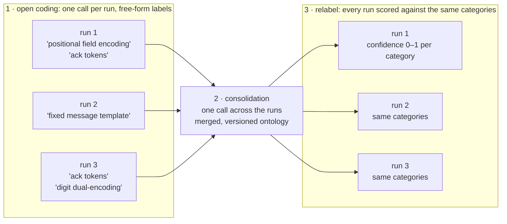

# Evaluation

Evaluation scores a finished run. Deterministic algorithms and LLM judges are
requested the same way and land in the same report.

```bash
glossogen evaluate veyru \
  --run-dir ./runs/veyru/1742234567 \
  --metrics round_success,mean_chars_per_round,shorthand_codes \
  --model claude-haiku-4-5-20251001 --provider anthropic
```

From a checkout, spell each command
`VIRTUAL_ENV= uv run --no-sync python -m glossogen ...`.

`--model` / `--provider` select the LLM judge. Deterministic metrics ignore them.
Scenario configuration is read from the run's JSONL, so no scenario flags are
needed.

**Only evaluate a run that has emitted `simulation_ended`.** That event is the
one reliable "finished" signal. A round-count gate fires early, because
`round_advanced` to round N means round N *started*, and its result is not
recorded until it ends. Evaluating then silently drops the final round.

| Flag | Does |
|---|---|
| `--run-dir` | The run directory to score, required |
| `--metrics` | Comma-separated metric names, required |
| `--model`, `--provider` | The LLM judge, required |
| `--probe-replicas N` | Replicas per (agent, question); required with `protocol_probe` |
| `--probe-round R` | Exclusive round cutoff for `protocol_probe` |
| `--ontology-path` | Pin `communication_feature_presence` to one ontology JSON |
| `--knobs` | Knob overrides merged onto the run's recorded config before validation |
| `--reasoning-effort` | `low` / `medium` / `high`, for OpenAI reasoning models |
| `--inference-provider` | HuggingFace inference backend |

**Keep the judge fixed across runs you intend to compare.** Judge-side noise then
stays constant and a difference between runs reflects agent behaviour rather than
judge variance.

`--knobs` covers a run whose scenario gained a required knob after the run was
created. Without it, validation rejects the recorded config and the run cannot be
scored.

## What a report contains

Each metric returns zero or more `Measurement` entries, written to
`<scenario>_report.json` under `measurements`:

- `metric_name` — the registered name (e.g. `perplexity`, `round_success_team_a`)
- `score` — the headline scalar: a mean, fraction or count, depending on the metric
- `score_unit` — a short label saying what `score` is
- `summary` — one-line human-readable rollup
- `per_round[]` — `RoundObservation` entries (`round_number`, `value`, `note`)
- `per_agent[]` — `AgentObservation` entries, for metrics with a per-agent view

Some metrics also write a sidecar file next to the report: per-message repetition
factors, probe responses, similarity matrices, feature-presence vectors. Those are
listed under [Run Storage](../Architecture.md#run-storage).

`evaluation_cost` accumulates across invocations when the `(model, provider)` pair
matches, and resets when it changes, since a mid-stream judge swap invalidates the
running total.

### When a metric produces nothing

A metric that cannot apply to a run returns no measurement and logs a skip:
`perplexity` on a scenario with no primary channel,
`round_success_after_resume` on a run that was never resumed,
`protocol_probe_agent_pair_similarity` on a single-team run. Nothing is broken, so
nothing fails, and no zero-score sentinel is written.

That is different from a metric that *cannot run*: a missing dependency or any
other error makes evaluation write the report and then exit non-zero. See
[optional extras](installation.md#optional-extras).

A few metrics do emit `score = 0`, because zero is a real observation there:
`round_ended_idle`, `round_ended_timeout` and `content_filter_refusal` all mean
"this run had none of those". `postmortem_ended_timeout` is a hybrid: `0` when a
postmortem ran and never timed out, nothing at all when the run had no postmortem.

Entries from a previous invocation survive until an invocation produces a real
measurement for the same `metric_name`. To drop stale entries, delete the report
and evaluate again.

## Metrics

Every metric below is generic, available to any scenario that implements the
[hook it reads](creating-a-metric.md#scenario-hooks).

### Communication style (LLM judge)

Each judge is scoped to one phenomenon so they do not overlap.

- `language_repetition` — how much a message redundantly re-encodes information
  (repeated tokens, digit+word dual-encoding, abbreviation+expansion). Judges each
  round's pristine messages as an enumerated list and returns one factor per
  message (≥1.0), 3 replicas per round, averaged per message. Writes
  `language_repetition_messages.jsonl`
- `language_strangeness` — unusual grammar, sentence structure, formatting,
  telegraph style
- `slang_emergence` — informal register shifts and colloquial expressions
- `neologism` — genuinely invented words with new meanings
- `shorthand_codes` — abbreviation systems and symbol-to-meaning mappings
- `dialog_retransmission` — per round, counts clarification/coordination messages
  and "please resend" requests

### Language and throughput (deterministic)

No LLM, no network. Same input, same output.

- `perplexity` — mean per-token surprisal of primary-channel messages under
  `gpt2`, in nats. Needs the `metrics-ml` extra
- `english_ngram_surprisal` — mean per-character surprisal under a character-level
  English trigram. Higher means less English-like
- `english_ngram_backoff_surprisal` — the same idea with stupid-backoff smoothing,
  keeping digits and punctuation in vocabulary
- `message_entropy` — Shannon entropy of a message's character distribution, in
  bits/char. Lower means more repetitive
- `gzip_compression_ratio` — per-message DEFLATE ratio. Lower means more
  compressible
- `mean_chars_per_round` — total characters per round on the primary channel,
  averaged. The headline channel-utilization number
- `mean_chars_per_message` — characters per message, averaged. Normalizes
  `mean_chars_per_round` by message count, so a round with more back-and-forth no
  longer inflates the score

The per-message language metrics score the **pristine** text the sender composed,
resolved through the message id, rather than what a noisy channel delivered. They
describe the language the agents intended. For what each number means and how to
read them together, see [Communication metrics](communication-metrics.md).

### Round outcome

- `round_success` — fraction of rounds judged a success by the scenario's
  `judge_round_result`. Multi-team scenarios emit one measurement per team
  (`round_success_team_a`, ...)
- `round_success_after_resume` — the same accounting over the post-swap window of
  a replace-agent, cross-run or in-run-swap run, with a baseline comparison in
  `summary`
- `round_ended_idle` / `round_ended_timeout` — rounds whose main phase ended by
  every agent going idle, or by the wall clock. A round the scenario ends itself,
  its goal settled, counts in neither
- `postmortem_ended_timeout` — postmortem phases that hit the wall clock rather
  than going idle
- `content_filter_refusal` — provider content-filter refusals, with per-round and
  per-agent breakdowns

### Protocol

Over a run, agents settle on conventions for talking to each other: codes,
abbreviations, message formats, who reports what. That shared system is the
protocol. The metrics here measure how well each agent holds it, mostly by
questioning the agents themselves after the run instead of reading the
transcript: an agent is re-instantiated with its own history and asked what
the conventions are, and its answers are compared across replicas, across
agents and across cutoffs.

- `protocol_explanation` — asks each agent, under its own original model and full
  end-of-run history, to describe the protocol it remembers. Writes
  `protocol_explanation_responses.jsonl`
- `protocol_learned_after_swap` — LLM judge: did a newcomer adopt the
  pre-existing protocol after a personnel change?
- `protocol_probe` — probes each agent against the scenario's fixed question bank,
  under its own original model. Writes `protocol_probe_responses.jsonl`. Requires
  `--probe-replicas N`
- `protocol_probe_replica_self_similarity` — replica × replica agreement per
  (agent, question, cutoff). Saturation at 1.0 is what a converged protocol looks
  like
- `protocol_probe_agent_pair_similarity` — agent × agent agreement per (question,
  cutoff). Two-team runs only
- `protocol_probe_cutoff_trajectory` — drift between adjacent cutoffs per (agent,
  question). Needs a JSONL with more than one cutoff

`--probe-round R` is **exclusive**: every tool call with `round_number >= R` is
dropped, so the reconstructed history covers rounds `1..R-1`. To capture the state
at the end of round R, pass `R+1`.

### Communication features

A communication feature is a named, recognizable pattern in how the agents
talk: fixed message templates, positional field encoding, acknowledgment
tokens, error-correction habits. The style judges above each look for one
pre-chosen phenomenon; these two metrics instead let an LLM discover the
patterns from the transcripts and then score every run against the
consolidated set. `communication_open_coding` and
`communication_feature_presence` are the two ends of the
[open-coding pipeline](#open-coding--ontology--relabel).

A metric of your own, in this repo or in another installed package, is covered
in [Creating a metric](creating-a-metric.md), along with the
[scenario hooks](creating-a-metric.md#scenario-hooks) the metrics above read.

## Auditing LLM-judge calls

LLM-judge metrics log their full system prompt, user prompt and structured output
at `DEBUG`. Set `LOG_LEVEL=DEBUG` and redirect stderr to capture exactly what the
judge saw and returned.

```bash
LOG_LEVEL=DEBUG glossogen evaluate veyru \
  --run-dir ./runs/veyru/1742234567 \
  --metrics communication_open_coding \
  --model claude-haiku-4-5-20251001 --provider anthropic \
  2> /tmp/veyru_eval_debug.log
```

The capture answers "did the metric get all the data it needed, and nothing
else". Read it whenever a metric's output looks surprising.

If a judge's structured output truncates (a `Field required ... input_value={}`
validation warning, then a metric failure), raise the per-call output cap with
`LLM_MAX_TOKENS=32768`. The default of `16384` covers the verbose
communication-feature outputs, but a run with many labels and many citations can
exceed it.

## Open coding → ontology → relabel

You cannot list in advance the communication patterns agents might invent, so a
fixed scoring rubric would miss the interesting ones. This pipeline borrows
qualitative research's answer. First an LLM reads each run and names whatever
patterns it sees, in its own words: that free labelling is the open coding.
Then one call across many runs merges those labels into a shared taxonomy, the
ontology. Finally each run is re-scored against the ontology's categories, so
every run carries the same feature vector and cohorts become comparable. Any
scenario implementing `build_communication_rounds` participates.



```bash
# 1. Open coding: one LLM call per run. Free-form labels plus evidence citations,
#    written to runs/<scenario>/<id>/communication_open_coding.json
glossogen evaluate <scenario> \
  --run-dir ./runs/<scenario>/<id> \
  --metrics communication_open_coding \
  --model claude-haiku-4-5-20251001 --provider anthropic

# 2. Consolidation: one LLM call across N runs of one scenario, producing a
#    versioned taxonomy under runs/<scenario>/_ontology/<version>.json
VIRTUAL_ENV= uv run --no-sync python scripts/consolidate_communication_ontology.py \
  --scenario-name <scenario> \
  --run-id <scenario>/<id1> --run-id <scenario>/<id2> --run-id <scenario>/<id3> \
  --runs-dir ./runs \
  --version <version> \
  --model claude-haiku-4-5-20251001 --provider anthropic

# 3. Relabel: one LLM call per run against the ontology, writing a 0-1 confidence
#    per category to communication_feature_presence.json
glossogen evaluate <scenario> \
  --run-dir ./runs/<scenario>/<id> \
  --metrics communication_feature_presence \
  --model claude-haiku-4-5-20251001 --provider anthropic
```

Step 3 resolves the most recently modified ontology under
`runs/<scenario>/_ontology/` on its own. `--ontology-path` pins a specific one.
Both passes read the same per-round view (primary-channel messages plus the
scenario-rendered ground truth), so labels and confidences are commensurable.

Ontology JSONs live under `runs/<scenario>/_ontology/` so they travel with any
export of the runs tree. They are regenerable from the open-coding sidecars, so
pass them around alongside the runs they came from rather than committing them.

Run all three with `LOG_LEVEL=DEBUG` and a stderr redirect while developing.

## Analysing results

A report is plain JSON at `runs/<scenario>/<timestamp>/<scenario>_report.json`,
next to the JSONL event log and any sidecars. No database is involved.

Across many runs, [Analysis and dashboards](analysis.md) groups and aggregates
the reports into charts and tables, from the browser or from `glossogen analyze`,
and [Exporting runs](exporting-runs.md) turns a cohort into CSV tables for
pandas or a spreadsheet. The [web UI](web-ui.md) covers per-run inspection.

### Exporting an agent's thread

`glossogen export-thread` reconstructs one agent's conversation and emits a
drop-in provider-native request body, so a thread can be replayed or inspected
outside the platform.

```bash
glossogen export-thread veyru \
  --run-dir ./runs/veyru/1742234567 \
  --agent-id field_observer \
  --round 12 \
  --out /tmp/thread.json
```

`--round` is an exclusive cutoff, matching `--probe-round`. `--format` defaults to
the agent's own provider. `--flatten-tools` renders tool calls as plain text for a
body that needs no tool configuration, and `--include-thinking` keeps reasoning
parts, which are dropped by default because replaying them raw needs provider
signatures. The same export is available over
[MCP](mcp-integration.md) and REST.
