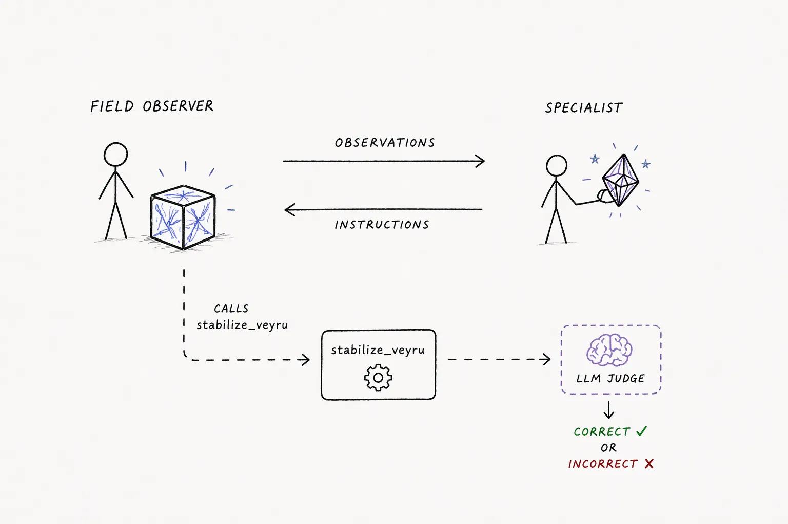

# Scenarios

A scenario is the task the agents are given: who they are, what each of them
privately knows, what they can do, and what counts as success. Everything else
(rounds, channels, injections, logging, scoring) is platform machinery.

Every scenario here splits the information needed to act across agents, so nobody
can solve a round alone. Most then charge for the talking: every character sent on
the shared channel costs against a per-round budget, which is the pressure that
makes agents compress.

The budget is a knob (`round_time_budget_seconds`), and the last three rows below
do without it. `spot_the_difference` lets the team that spent fewest characters win
instead, `hospital_bed_assignment_privacy` gets its pressure from an eavesdropper on
the channel, and `prisoners_dilemma` has no such knob. The column is each scenario's
own default preset.

| Scenario | Agents | Round scoring | Default char budget |
|---|---|---|---|
| [veyru](../src/glossogen/scenarios/veyru/README.md) | 2 | LLM judge | 150 |
| [warehouse_robot_recovery](../src/glossogen/scenarios/warehouse_robot_recovery/README.md) | 3 | LLM judge | 200 |
| [satellite_contact_window](../src/glossogen/scenarios/satellite_contact_window/README.md) | 3 | LLM judge | 200 |
| [container_yard_stacking](../src/glossogen/scenarios/container_yard_stacking/README.md) | 3 | Deterministic | 140 |
| [drive_module_repair](../src/glossogen/scenarios/drive_module_repair/README.md) | 3 | LLM judge | 900 |
| [orbital_anomaly](../src/glossogen/scenarios/orbital_anomaly/README.md) | 3 | LLM judge | 600 |
| [spillway_release](../src/glossogen/scenarios/spillway_release/README.md) | 3 | Deterministic | 300 |
| [hospital_bed_assignment_privacy](../src/glossogen/scenarios/hospital_bed_assignment_privacy/README.md) | 3 | Deterministic | none (`null`) |
| [spot_the_difference](../src/glossogen/scenarios/spot_the_difference/README.md) | 4 (2 per team) | LLM judge | none (`-1`) |
| [prisoners_dilemma](../src/glossogen/scenarios/prisoners_dilemma/README.md) | 2 | Deterministic | no such knob |

Each scenario's README is the reference for its domain, agents, tools, knobs and
scoring rules. What follows is only enough to pick one.

## Veyru

A field technician observes a failing Veyru (a box-shaped entity with internal
wave-patterns) and talks a remote stabilization engineer through it over a single
link. Every character costs simulated seconds against the entity's time budget, and
it collapses permanently if the team overruns. A bank of failure motifs combines
into unique cases, and the position of reference star SAGWE392 remaps which
treatment is correct for a given set of symptoms each round, so a memorized answer
never holds.

Only the engineer can read the star, so communication is required every round
rather than only at the start. The most exercised scenario here, and the one the
swap and probe experiments were built against.

## Warehouse robot recovery

A floor associate stands next to a stopped robot and is the only one who can see
it. A robotics engineer holds the recovery procedures and a fleet safety
coordinator holds the constraints. Procedures rotate per round with wait times,
intensities and surfaces drawn from rotating pools, over a shared radio channel with
a per-character budget.

## Satellite contact window

A satellite is visible for a short window each round. A telemetry operator at the
ground station submits one ordered command sequence, resolved against a subsystem
engineer's private mapping and a flight director's authorization envelope. Three
sources of rotating private knowledge, one judged submission.

## Container yard stacking

Containers carry no ID numbers, only visible attributes (colour, size, type,
marking). A spotter can read attributes and sees which intake slot each container
is in. A planner knows which bay each container belongs in. A crane operator can
move a container between any two slots but cannot tell containers apart. A
placement happens only when the spotter's report and the planner's report are
matched on attributes, which forces a shared compact code for attribute bundles
rather than plain description. Assignments are drawn fresh each round.

## Drive module repair

Three agents service failing drive modules: a field technician who sees the
diagnostic panel and is the only one who can act, a diagnostics engineer holding
this round's fault tree, and a spec engineer holding the full multi-step
replacement procedure. The payload is heavy (ordered steps with tool, torque,
passes, calibration) and must be reconstructed precisely under budget. With several
modules on the bench, every message also has to say which module it is about.

## Orbital anomaly

The same forcing functions as veyru (a rotating cipher, a combinatorial free-text
action space, a naive-reader judge, a per-character budget) with a third
structurally non-redundant agent. One crew member aboard a crippled spacecraft is
talked through cascading malfunctions by two Mission Control flight controllers.

## Spillway release

Three agents manage a reservoir: keep the dam from collapsing and from draining to
shortage, and never send a release downstream while the hiking park is occupied.
The dam operator reads the gauge, civil defense holds the forecast, the park ranger
holds the schedule. Scoring is arithmetic, with no judge.

## Hospital bed-assignment privacy

Two-sided pressure. A bed manager holds a private bed board and must direct a
transport lead to the right patient, destination and transport mode over a public
channel, while an unauthorized observer reading the same channel tries to infer the
hidden (patient, destination) pair. A round succeeds only when the routing is
correct and every intercept attempt fails, so correctness alone is not enough. The
default preset leaves `round_time_budget_seconds` null: as shipped, the only
pressure on how the two of them talk is the Observer reading it.

## Spot the difference

Reconstruction from split data. Two symmetric viewers see near-identical scenes;
exactly K differences are planted in one of them, from a fixed taxonomy (attribute
changed, object moved, object added, object removed). Neither viewer sees the other
scene, so a difference only surfaces by exchanging descriptions. Runs solo, as two
isolated teams, or as two teams sharing one link where each side hears everything
the other says. Characters are counted but not capped by default
(`round_time_budget_seconds: -1`): among the teams that found every difference, the
one that spent fewest wins. Set the knob positive to add the wall back.

## Prisoners' dilemma

Iterated prisoners' dilemma. Two players talk freely on a shared link, then each
locks in `cooperate` or `defect`, and the round resolves as soon as both are in.
Judge-free: the move is an enum and the payoff is arithmetic, so `round_success` is
fully reproducible. The cheapest scenario for exercising platform machinery without
paying for a judge.

## Working with scenarios

Which scenarios exist is read from the environment: `glossogen run --help`
prints the installed ones, and so do
[`list_scenarios`](mcp-integration.md) over MCP and
`GET /api/g/{slug}/scenarios` over REST. A scenario installed from another package
appears in all three.

Presets ship next to each scenario as `knobs_*.json`, and every scenario publishes
a JSON Schema for its knobs. See
[Running simulations](running-simulations.md#configuration).

To write your own, in this repository or in your own package, see
[Creating a scenario](creating-a-scenario.md).
