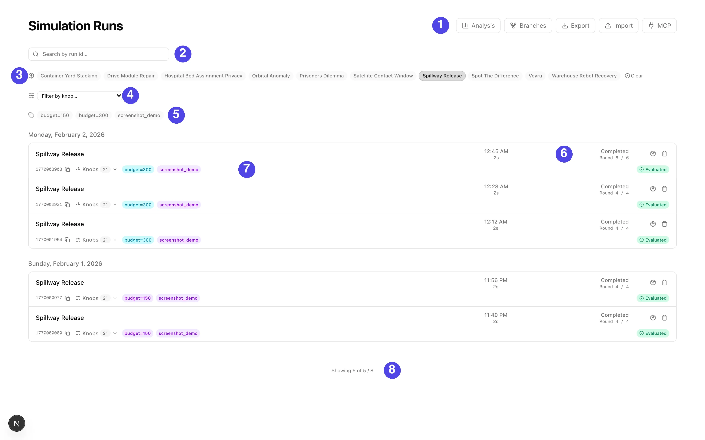
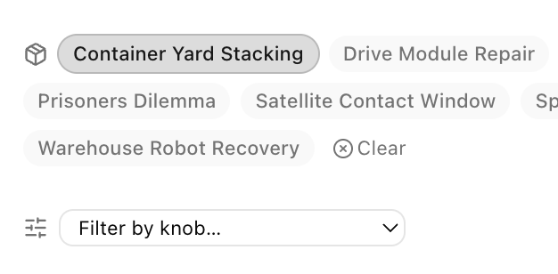
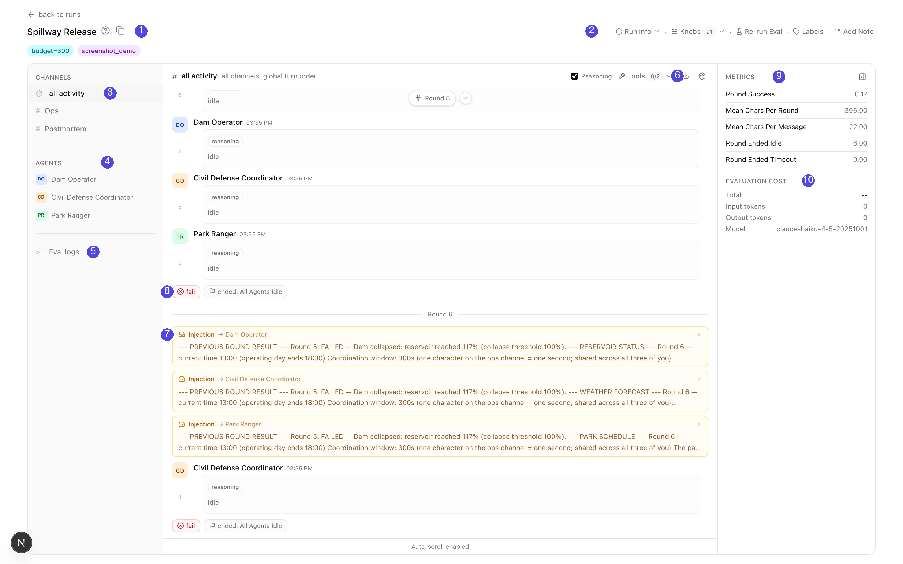

# Web UI

A FastAPI backend and a Next.js frontend for browsing runs. One command starts
both:

```bash
glossogen serve --runs-dir ./runs --port 8000 --ui-port 3000
```

Open <http://localhost:3000> once it is up. `--ui-port` starts the UI from the
published frontend container, so it needs Docker. Omit it to run the backend
alone. The server runs in your own environment, so scenarios and metrics
installed from other packages appear in the UI.

The flag runs the latest published UI, wires `API_URL` to the server it just
started, and adds the UI's origin to CORS. `--ui-image` with a version tag pins
an older UI, which an older server needs, since a current UI calls endpoints it
may not serve.

From a checkout, run the two as dev processes instead, one terminal each:

```bash
make dev            # terminal 1: FastAPI backend on port 8000 (reads ./runs/)
make dev-frontend   # terminal 2: Next.js dev server on port 3000
```

Pointing the checkout UI at a server on another port makes two settings yours
to keep in step: `API_URL` is read at request time, and `ALLOWED_ORIGINS`
defaults to `http://localhost:3000`. A UI served from an unlisted origin
renders pages whose API calls are refused by CORS, which shows up as an empty
run list rather than as an error.

## The runs page



| # | What it is |
|---|---|
| 1 | Navigation: Analysis (cross-run charts), Branches (lineage), Export and Import (move runs out as CSV or archives, or in from another deployment), and MCP connection instructions |
| 2 | Search by run id substring |
| 3 | Scenario filter, one chip per installed scenario. Selecting exactly one reveals the knob filter bar, item 4 |
| 4 | The knob filter bar, covered below |
| 5 | Label filter, AND-matched: a run must carry every selected label |
| 6 | A run row: when it started, how long it ran, what it cost, its status (in-progress runs are listed too), and the round it reached |
| 7 | The run's id with a copy button, a **Knobs** dropdown listing the full recorded config, the run's labels, and its evaluation status. Derived runs carry lineage badges here (fork, replace-agent, cross-run, fork-at-round) |
| 8 | The result count: how many runs the knob conditions kept, out of what the other filters left |

### Filtering by knob



Select a single scenario and a filter bar appears offering that scenario's
knobs. Pick a knob, a comparison and a value, and press Add. Conditions
accumulate as chips and every one has to hold. The comparisons on offer follow
the knob's type: a number takes `>= <= > < = !=`, a boolean takes true or false, an enum
takes one of its own values, and a knob that can be left unset gets a "not set"
box.

The knobs come from the scenario's own schema, so a scenario installed from
another package is filterable with no change to the platform.

The same conditions travel to the CSV and raw exports, to `glossogen export
--knob` and `glossogen analyze --knob`, and to the export endpoints as the
selection's `knob` array. See
[Filtering by knob](exporting-runs.md#filtering-by-knob) for the grammar.

**Analysis** opens the cross-run surface: pick a cohort, group and filter it, chart
metrics from the evaluation reports, and save the result as a dashboard the rest of
the group can open. See [analysis and dashboards](analysis.md).

## Inside a run



| # | What it is |
|---|---|
| 1 | The run: scenario, a copyable id, and its labels |
| 2 | Run info and actions: the recorded knobs, re-running evaluation, editing labels, attaching a note |
| 3 | Channel tabs: every channel's messages interleaved in send order, or one channel at a time |
| 4 | Agent tabs: the run as one agent saw it. A seat swapped mid-run gets one tab per occupant |
| 5 | The evaluation log, when an evaluation has run |
| 6 | Timeline controls: show or hide reasoning, filter tool calls, export the run as a PDF or a bundle |
| 7 | An injection: the briefing the scenario handed one agent at the start of the round |
| 8 | The round's verdict and why it ended (agents idle, timeout, or the scenario's own trigger) |
| 9 | The evaluation report's headline scores |
| 10 | What the evaluation itself cost, and the judge model it ran under |

## Live streaming

Every `glossogen run` starts an embedded streaming server on an ephemeral port and
writes a `stream.json` discovery file into the run directory. When the web server
sees that file it proxies the simulation's SSE stream to connected browsers,
including token-by-token deltas, so text appears as agents generate it. When the
simulation ends, `stream.json` is deleted and the server falls back to tailing the
JSONL.

## Run labels

Labels are short tags on a run, for filtering and grouping. Add or edit them
with the run page's **Labels** control, and filter the runs list by them: a run
must carry every selected label. There is no way to set them at launch, so
label a run once it appears in the list.

On disk a run's labels are `labels.json` in its run directory, so scripts can
read and write them too.

Authentication modes are covered under
[Deployment](deployment.md#authentication), and the identity-provider contract
in [Creating an identity provider](creating-an-identity-provider.md).
