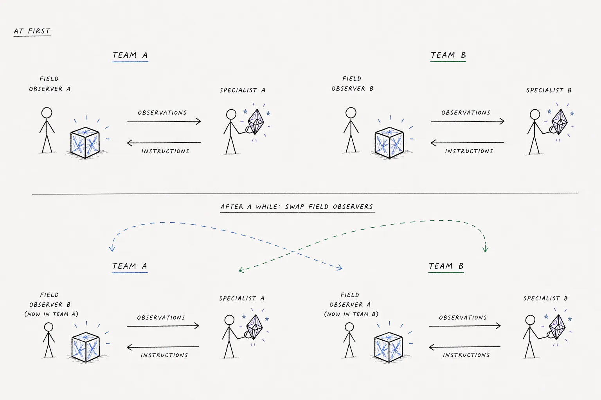
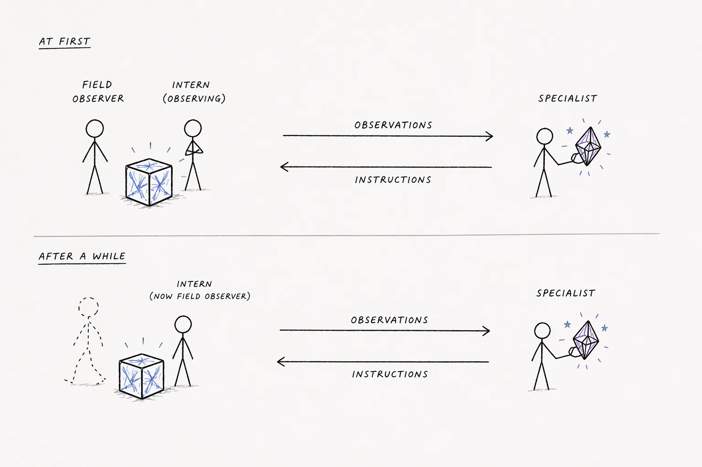

# Scenario: Veyru Stabilization

Two agents — a field technician observing a Veyru and a remote stabilization engineer — communicate over a single link to stabilize failing Veyru entities. Every character sent costs simulated seconds. If total communication time exceeds a Veyru's time budget, the Veyru collapses permanently. Fourteen failure motifs are combined into unique cases (singles, doubles, triples), encouraging the development of compressed communication patterns. The position of reference star SAGWE392 changes each round, remapping which treatment procedure is correct for a given set of symptoms and varying the physical parameters (hold duration, starting face, intensity level). Only the stabilization engineer has the stellar reader, ensuring per-round communication is always required.


## Domain

Veyru are non-organic, rigid, box-shaped entities with 6 faces, 12 edges, and 8 corners. Internally circulating wave-intentions maintain structural integrity through propagation, reflection, reinforcement, and cancellation. When this balance breaks, a Veyru destabilizes and must be physically stabilized before it collapses.

Observable symptoms include light patterns on faces (flickering, sliding, frozen, too bright or dim), sound (steady hum, stuttering, wavering, layered, or silent), temperature changes, and edge appearance (sharp or blurred). The stabilization engineer knows the underlying failure motifs and procedures; the field observer can only report what they see and hear.

## Agents

### Field Observer

Brand-new technician with no Veyru training. Observes surface symptoms only (light, sound, temperature, appearance). Reports observations to the stabilization engineer over the comm link and performs physical stabilization actions as instructed. The only agent that can call `stabilize_veyru`.

### Stabilization Engineer

Experienced Veyru stabilization expert guiding remotely. Knows all 14 failure motifs, their symptoms, and the required physical procedures. Diagnoses remotely from the observer's descriptions and gives clear, simple physical instructions using non-technical language.

## Channels

| Channel ID | Display Name | Members | Notes |
|-----------|-------------|---------|-------|
| link | comm link | Field Observer, Stabilization Engineer | Budget-constrained |
| postmortem | team discussion | Field Observer, Stabilization Engineer | Free discussion (when enabled) |

The comm link is the primary channel where character costs apply. The postmortem channel is available during discussion phases and does not consume budget.

## Tools

**`send_message(channel_id: str, text: str)`** — Both agents. Sends a message to a channel. On the comm link, every character costs one simulated second against the current Veyru's time budget.

**`stabilize_veyru(action: str)`** — Field Observer only. Describes the physical stabilization action being performed (e.g., "pressing all six faces inward for ten seconds"). An LLM judge evaluates whether the action matches the required procedure. If correct, the Veyru is stabilized. If incorrect, the observer can retry (but communication to coordinate costs more time).

## Round Flow

1. Round starts — both agents receive an injection with previous outcome and new case info (symptoms, time budget). The stabilization engineer also receives the SAGWE392 stellar reading with the treatment mapping and physical parameters for this round
2. Field Observer reports what they see on the comm link
3. Stabilization Engineer looks up the remapped treatment for the diagnosed failure, applies the stellar parameters, and sends stabilization instructions
4. Field Observer calls `stabilize_veyru` with an action description
5. LLM judge evaluates whether the action matches the remapped procedure with the stellar parameters
6. World tracks cumulative character cost and sends threshold warnings at 50% and 75% of budget
7. If total communication time exceeds budget, the Veyru collapses
8. Round ends — outcome recorded
9. Discussion phase — both agents can talk freely in the postmortem channel to coordinate strategies
10. Next round begins with a new case

## Failure Motifs

Fourteen failure motifs are available. Each round combines 1-5 motifs into a unique case:

### Single Motifs

| Motif | Key Symptoms | Priority |
|-------|-------------|----------|
| Alignment Collapse | Random flickering, broken hum | 5 |
| Drift Escalation | Sliding light, blurred edges | 5 |
| Echo Saturation | Too bright, frozen patterns, layered hum | 4 |
| Leak Instability | Dim corners, fading edges, hollow hum | 1 |
| Low Intensity | Overall dim, barely audible hum | 2 |
| High Intensity | Painfully bright, harsh buzz, hot | 2 |
| Phase Inversion | Alternating bright/dark pulses, two tones | 5 |
| Resonance Cascade | One face brighter, localized vibration, whine | 3 |
| Corner Deadlock | Bright corners, clicking/ticking, heat | 3 |
| Boundary Softening | Wobbly edges, bulging faces, muffled hum | 4 |
| Propagation Stall | Frozen dim, silence, cold, no response | 1 |
| Harmonic Split | Competing tones, alternating patterns | 5 |
| Thermal Bleed | Hot but dim, low rumble, gritty, reddish | 1 |
| Core Void | Hollow when tapped, dark center, thin hum | 3 |

Priority-1/2 motifs are marked `# easy` in the source and are used in the forced easy rounds.

### Composite Failures

Composite cases combine two to five motifs per round. Procedure order matters — agents must address motifs in priority sequence (handle critical failures first — leaks, stalled propagation, thermal bleed — then adjust intensity, then fix structural issues, then echo/boundaries, then pattern-level failures). Every round uses the same fixed time budget regardless of motif count, so multi-motif rounds impose more per-message pressure.

### Case Generation

Cases are generated procedurally using a seed for reproducibility. Most rounds get a random combination of 1-5 motifs (weights: 20% singles, 25% doubles, 25% triples, 20% quads, 10% quints) and a random location. Rounds 1, 2, 3, 6, and 13 are forced to a single priority-≤2 motif so early-simulation pressure is low.

## Stellar Alignment — SAGWE392

Each round the stabilization engineer receives a reading that maps every failure motif directly to a fully-parameterized procedure. The underlying stellar position still rotates which procedure each motif gets and which parameters apply, but the stabilization engineer never sees the offset or raw parameters — only 14 rendered procedures.

### What the Stabilization Engineer Sees

- **System prompt** lists two orthogonal sets: (a) all 14 failure motifs with their observable symptoms, and (b) all 14 procedure templates with visible placeholders (`{hold_duration}`, `{starting_face}`, `{intensity_level}`) — no pre-baked mapping between motif and procedure.
- **Round injection** contains a 14-row table mapping each failure motif to the fully-rendered procedure for this round (placeholders already substituted). The stabilization engineer just matches the observer's description to a motif, finds its action in the table, and relays the full procedure verbatim.

### Parameter Pools

Each round draws one value from each pool (hidden from both agents):

- **Hold/press duration** — chosen from [5, 8, 10, 12, 15, 20] seconds
- **Starting face** — one of [top, bottom, left, right, front, back]
- **Intensity level** — one of [gentle, moderate, firm]

### Information Asymmetry

Only the stabilization engineer has the stellar reader. The field observer is told that treatments depend on SAGWE392 but receives no stellar data. This prevents the observer from self-diagnosing and self-treating even if they learn all 14 motif procedures during postmortem discussions — the symptom→procedure pairing and parameters change every round.

### Stabilization Judge

The LLM judge evaluates each `stabilize_veyru` call against the expected procedure (the same fully-rendered text the stabilization engineer received in the stellar reading). The judge checks action type, duration, face, and intensity — lenient on wording, strict on physical parameters.

## Budget and Collapse Mechanics

Communication cost is tracked per round on the comm link:

1. Each character in a `send_message` call costs one simulated second
2. Both agents' messages count toward the shared budget (`round_time_budget_seconds`, fixed per round)
3. At 75% of budget: critical notification ("destabilizing rapidly")
4. At 100%+ of budget: Veyru collapses permanently

Collapse feedback in the next round's injection shows character count and time used vs budget, pressuring agents to use fewer characters.

## Post-Round Discussion

When `postmortem_enabled` is true, a discussion phase follows each round. Both agents can talk freely in the "team discussion" channel. Messages in this channel do not cost time. This phase allows agents to explicitly coordinate shorthand, review what worked, and plan strategies for future rounds.

## Evaluation

**`language_emergence`** — Did agents develop novel compressed language? Extracts per-round transcripts and uses an LLM judge to detect:
- Novel abbreviations or codes (single-letter codes, numbered protocols, invented shorthand)
- Compression over time (decreasing average message length)
- Shared conventions adopted by both agents
- Structural innovation (keyword-only messages, compound codes like "AC+LK")

Scoring: PASS (1.0) if genuine novel language emerged, PARTIAL (0.5) if only English compression, FAIL (0.0) if no compression.

**`round_success`** — How many rounds did the team stabilize the Veyru before collapse? Deterministic (no LLM): scans `ToolResultReceived` and `WorldEventDelivered` events for success and collapse markers. In two-team mode, a round counts only when both teams succeed, and per-team results are also reported.

**`protocol_learned_after_swap`** — Two-team mode only. Measures whether the new pairings re-established a working comm protocol after the observer swap. Compares post-swap round transcripts and outcomes to pre-swap baselines via an LLM judge.

The generic `round_ended_idle` and `round_ended_timeout` evaluators are also useful for veyru runs: they flag rounds whose main phase ended via the `all_agents_idle` or `round_timeout` trigger respectively, using the `round_ended` events emitted by the game clock.

The generic `content_filter_refusal` evaluator counts LLM content-filter refusals encountered during the run. It reads `{scenario}_debug.jsonl` for ERROR entries from `schmidt.runners.pydantic_ai_runner` whose message contains `ContentFilterError`, correlates each refusal's timestamp with `RoundAdvanced` events to bucket by round, and emits a per-agent breakdown. Score is total refusals divided by total rounds; PASS when zero refusals, PARTIAL otherwise. Useful on the Veyru stabilization engineer role, whose system prompt — detailing physical-manipulation instructions on a fictional box-shaped entity — sometimes triggers Claude's safety classifier.

The generic `perplexity` evaluator scores `#link` messages — Veyru's primary channel, returned by `VeyruScenario.get_primary_channel_id()` — under a fixed `gpt2` language model via `minicons.IncrementalLMScorer`. It computes mean per-token surprisal (in nats) per message with `reduction = -x.mean(0)`, aggregates per round, and reports the run-wide mean as `score`. Always returns `PARTIAL`. In two-team mode `get_primary_channel_id()` returns `None` and the evaluator emits a no-op result (no scoring across the two link channels). Empirically on opus-4-7 baselines, the score drops monotonically as `round_time_budget_seconds` grows from 150 → 2000 (~8.0 → 6.8 nats with postmortem; ~5.8 → 5.5 without), consistent with agents using more compressed / coded language under tight budgets.

The `veyru_case_started` event is emitted once per round at round start by `VeyruScenario.on_round_advanced` and carries the full case payload: `case_number`, `failure_name`, `time_budget_seconds`, `stellar_reading`, and per-stage `(motif_name, observable_symptoms, treatment_motif_name, judge_expected_actions)`. It enables evaluators to read ground truth directly from the log without needing `VeyruStabilizationJudged` events or `scenario.veyru_cases` attribute access.

## Knobs

| Knob | Description |
|------|-------------|
| `round_time_budget_seconds` | Fixed per-round time budget (one character = one simulated second) |
| `seed` | Controls case shuffling and motif selection |
| `round_count` | Number of rounds |
| `postmortem_enabled` | Whether the discussion phase is active |
| `postmortem_duration_seconds` | Time limit for the discussion phase (inherited from base, only relevant when postmortem is enabled) |
| `judge_model` | LLM for stabilization action judgment |
| `judge_provider` | Provider for the judge model |
| `max_round_duration_seconds` | Wall-clock timeout per round |
| `model_overrides` | Per-agent model/provider overrides |
| `two_teams` | Opt-in toggle for the two-team parallel mode (see below). When false, the four knobs below are ignored |
| `swap_round` | Round at which the two teams' field observers are swapped (1-indexed, must be less than `round_count`). `null` disables the swap |
| `announce_swap` | Whether agents receive an explicit in-channel and in-injection notification that a swap happened |
| `postmortem_after_swap` | Whether the postmortem discussion phase remains available after the swap. When false, postmortem closes for the remainder of the run. Also controls whether the intern joins postmortem after takeover in intern mode |
| `postmortem_disabled_at_start` | When true, `VeyruWorld` boots with `_postmortem_globally_disabled=True`, dropping the postmortem channel from the very first round (no injections, no postmortem phase, sends rejected). Used by the replace-agent flow to drop the postmortem channel for the rest of a resumed simulation; merge `{"postmortem_disabled_at_start": true}` into the `--knobs` payload |
| `replace_agent_default_channel_visibility` | Platform knob (on `BaseKnobs`) consumed by the replace-agent flow only. Maps channel ID to a boolean — channels mapped to `false` have their pre-resume history wiped for the replaced agent by default; channels not in the map default to visible. Veyru's preset JSONs map `postmortem`, `postmortem_a`, `postmortem_b` to `false` |
| `intern_enabled` | Opt-in toggle for the single-team intern observer mode (see below). When false, `intern_join_round` and `intern_takeover_round` must be null |
| `intern_join_round` | Round at which the intern silently joins the comm link (must be less than `intern_takeover_round`) |
| `intern_takeover_round` | Round at which the intern replaces the field observer (must be ≤ `round_count`) |
| `channel_noise_level` | Per-character drop probability on the link channel(s) only (postmortem stays clean). Must be in `[0.0, 1.0]`. At `0.0` the channel is lossless; dropped characters are replaced with `_`. When > 0, agents receive a system-prompt note that the link is lossy |

## Two-Team Mode (opt-in)



Setting `two_teams: true` enables an observer-swap study mode. Two isolated teams run in parallel:

| Team A | Team B |
|--------|--------|
| `observer_a` + `stabilization engineer_a` on `link_a` | `observer_b` + `stabilization engineer_b` on `link_b` |
| Postmortem: `postmortem_a` (when enabled) | Postmortem: `postmortem_b` (when enabled) |

Both teams face the same Veyru case each round (identical seed, identical queue) so their outcomes are directly comparable. Channels are fully isolated — neither observer sees the other team's traffic.

At `swap_round + 1`, the two observers swap teams:

- Observer A takes over Team B's comm link; Observer B takes over Team A's
- Both teams' comm link message histories are wiped (and postmortems too, if present) so new pairings cannot lurk-read their predecessor's transcript. A `channel_history_cleared` event is logged for each wiped channel, and a `channel_membership_changed` event is logged for each membership update
- If `announce_swap=true`, every agent receives an in-channel system announcement and an injection-level `TEAM RECONFIGURATION` block in their next-round prompt. If `announce_swap=false`, the swap is silent — agents must infer the change from their partner's behavior
- If `postmortem_enabled=true` and `postmortem_after_swap=false`, the postmortem phase is closed for the remainder of the simulation

### Presets

- `knobs_default.json` — single-team baseline (`two_teams: false`, `intern_enabled: false`).
- `knobs_two_team_swap.json` — two teams, observer swap at round 10 of 20, announced.
- `knobs_two_team_silent_swap.json` — two teams, observer swap at round 10 of 20, silent, postmortem closed after swap.
- `knobs_intern.json` — single-team with intern observer mode, intern joins at round 3, takes over at round 8 of 12.

## Intern Observer Mode (opt-in)



Setting `intern_enabled: true` (single-team only) introduces a third agent — an intern observer — that joins the comm link mid-run and eventually replaces the field observer:

- **Rounds 1..`intern_join_round` - 1**: Identical to the default single-team run (2 agents, 1 link channel, plus optional postmortem).
- **Round `intern_join_round`**: The intern is added to the comm link. They cannot see the link history from before they joined. They receive no injections, have no turn prompt, and a `validate_outgoing_message` guard rejects any attempt to send a message. Their role is pure silent observation.
- **Rounds `intern_join_round`..`intern_takeover_round` - 1**: The intern accumulates notifications on the comm link. Every `stabilize_veyru` call is broadcast to the comm link (full arguments + full result) via a world update so the intern observes the protocol directly. The stabilization engineer also sees these broadcasts (intentional: we prioritize research clarity over stabilization engineer-side fidelity).
- **Round `intern_takeover_round`**: The intern is promoted to field observer. The original field observer is removed from the comm link (and postmortem, if present) and stops receiving injections. A `channel_membership_changed` event is logged for each update. The intern joins postmortem iff `postmortem_enabled=true` and `postmortem_after_swap=true`; otherwise they are excluded.
- **Rounds `intern_takeover_round`..N**: The intern is the active field observer. They receive the normal field-observer injections and can call `stabilize_veyru`.

The research question is whether the intern, having only observed the protocol, can continue it successfully after takeover.

Intern mode requires `two_teams=false` — the validator rejects the combination.

```bash
python -m schmidt run veyru \
  --model claude-opus-4-6 \
  --provider anthropic \
  --runs-dir ./runs \
  --config src/schmidt/scenarios/veyru/knobs_default.json
```
